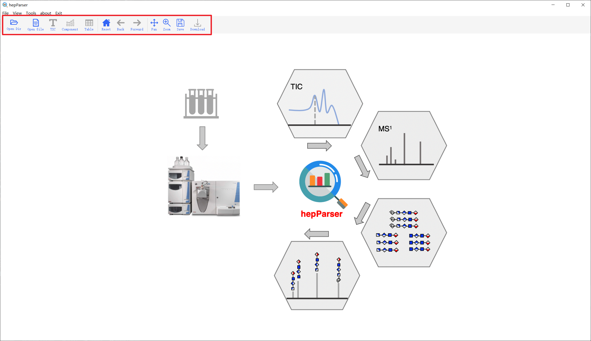
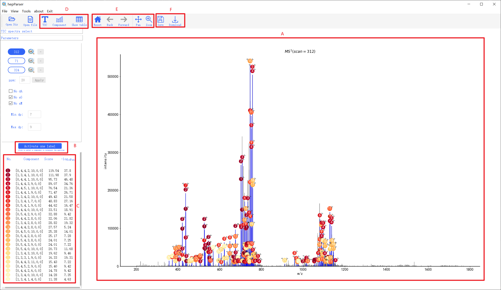
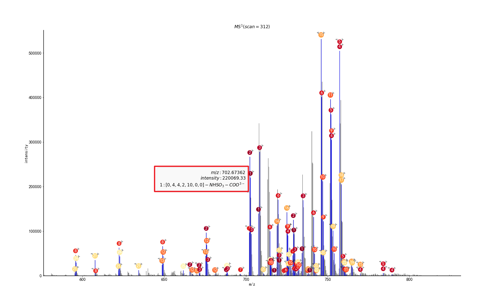
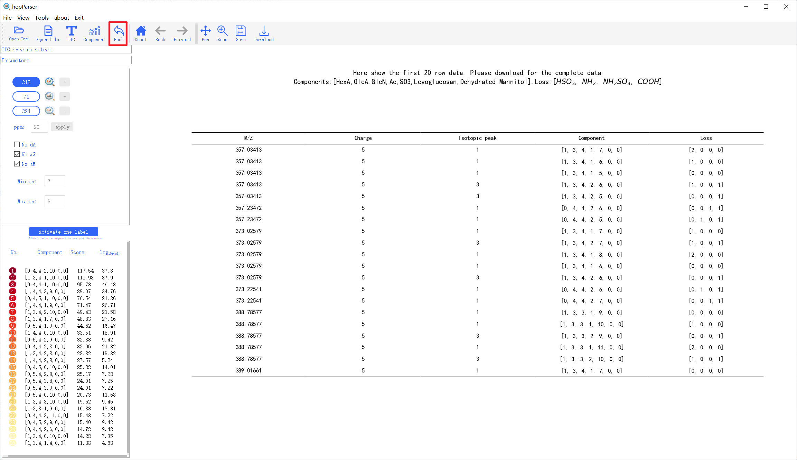
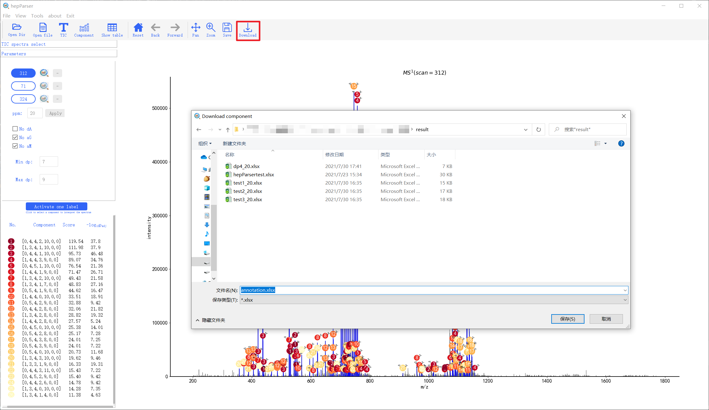
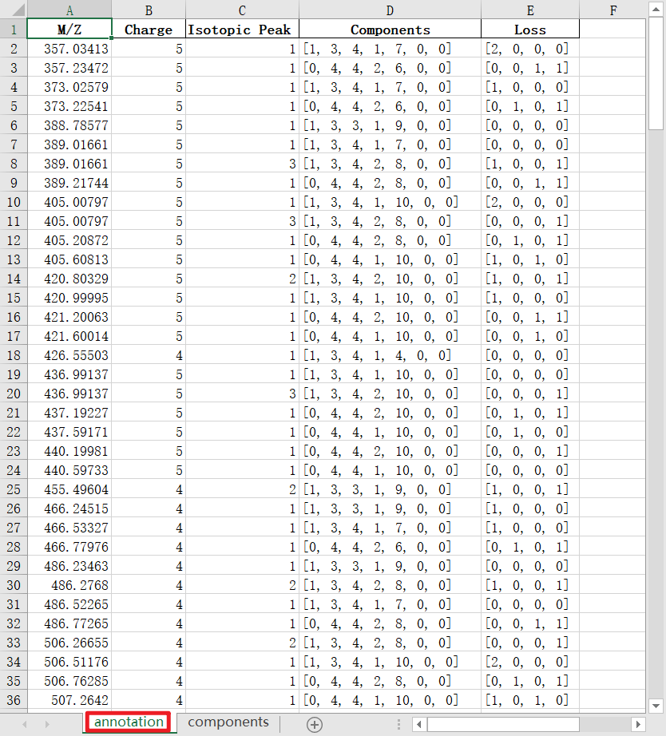
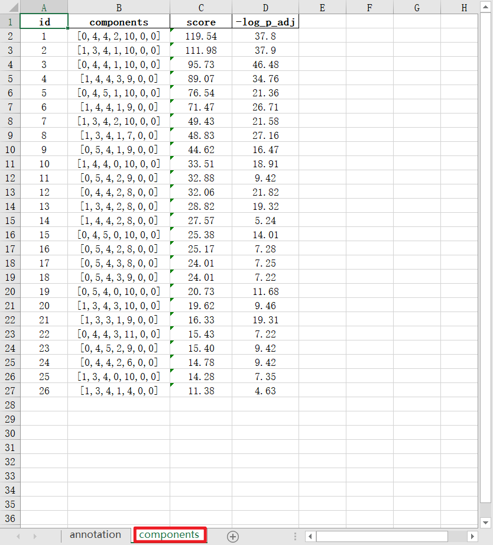
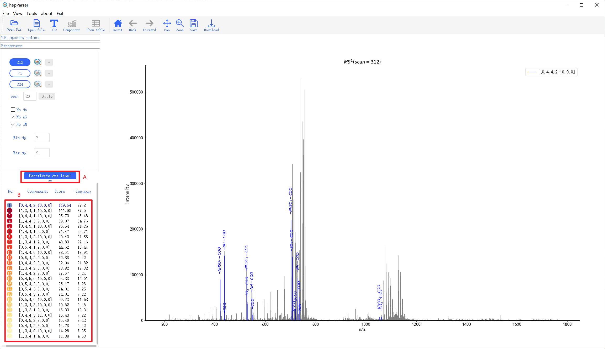

# hepParser
- - - 
An intelligent software for deciphering low molecular weight heparin based on Mass spectrometry
## Requirement
- - -
```
 python==3.6 or 3.7
 pyqt5==5.13.2
 numpy==1.17.4
 matplotlib==3.2.1
 pandas>=0.25.3
 scikit-learn==0.24.2
 Pillow==6.2.1
 xlwt==1.3.0
 mplcursors==0.3
 regex
 openpyxl
 rpy2
 scipy
```

## Sample data
- - - 
Here we provide three test `mzml` data (*/sample_data/*) for users to become familiar with hepParser functions

The three sample data come from https://code.google.com/archive/p/glycresoft/downloads , provided by GlycReSoft, which were triplicate LC/MS runs acquired using lung HS.  

For more detailed information about sample data, please refer this paper:https://doi.org/10.1371/journal.pone.0045474 

## Tutorial
- - - 
### Start interface

If users run hepParser successfully, the new window will be presented. The window contains two panels, main panel and tool panel.



### Open file

With the embedding of [MSConvert](https://proteowizard.sourceforge.io/download.html),  hepParser support to read two format data file (`.mzml` and `.raw` directory). Here we use a `.mzml` file as the example.
As shown in below, users can choose `.mzml` data file by clicking '**Open file**'.


### Show TIC

After read MS data successfully, hepParser would show the Total Ion Chromatography(TIC) in the main panel first and choose the most intensive data point automatically.
Users can choose any scanning they are interested in by chick on it in TIC. The selected scanning were presented at the left panel, and can be deleted by clicking the `-` button on its right.
Here we choose `312`,`71` and `324` scanning as the example.
Then, users can click any of them at left panel to do the next analysis.


### Set parameters

When users select one scanning (Here is `312`), hepParser would show the original mass spectrum in the main panel and title it with the scan number.
The left panel contains several parameters for custom setting, which can be considered as four parts:
> A: Control the scanning currently being analysing.
>> Users can change the analysed scanning by clicking the scan number button. 
> 
>> After setting all parameters in this panel, users can start the analysis of the selected scanning (in blue) by clicking the icon of Magnifying glass.

> B: Control the `ppm` in analysing.
>> The default `ppm` in hepParser is 20. User can change it according to the resolution of Mass spectrometer. The general value range is 10 to 50.
> 
>> After setting all parameters in this panel, users can start the analysis of the selected scanning (in blue) by clicking the `Apply` button.

> C: Control the special components of the results.
>> According to the prior knowledge of sample data, users can limit the theoretical components of enumeration. \
>> If `No dA` is checked, the enumeration will filter out components containing **unsaturated uronic acid**;\
>> If `No aG` is checked, the enumeration will filter out components containing **Levoglucosan**;\
>> If `No aM` is checked, the enumeration will filter out components containing **Anhydromannitol**;

> D: Control the degrees of polymerization (dp).
>> According to the prior knowledge of sample data, users can limit the theoretical components of enumeration.\
>> The default `Min dp` and `Max dp` are set as 0 and 20. Users can input more specific range of dp.


### Analyse MS data

Once users start the analysing of selected scaning, hepParser would show the progress bar of the analysis, and show the possible existent components in sample.


The default checked components are the results recommended by hepParser. 
Users can change the selected components by the checkboxes with the components (region A), or batch add or delete through `Check all` or `Recommend`(region B).\
After determining the components, users can click the `Annotate` button to annotate the MS spectrum with the selected components.

### parser the sample and annotate the MS spectrum
The analysis results is shown as follows:



The main annotation results are shown in main panel (region A). Each annotated peak is marked as blue and labeled by the No. of component which can match this peak.
1. Users can zoom, pan or reset the main annotation MS spectrum with the help of tools (region E).
2. Users can check the detailed matched information of each annotated peaks in tips window when they hover the cursor over the peak.   
 


The main components results are shown at bottom left (region C). Here show the No., composition, matched score and -log<sub>10</sub>p<sub>adj</sub> of each component.

3. Users can return TIC view to reselect scanning or change the selected components by clicking the `TIC` or `Component` button in tools (region D).

4. Users can check the matched table of this scanning by clicking the `Show table` button (region D).



5. Users can download the components results and annotation results by clicking the `Download` button (region F).





6. Users can activate the 'one label' module by clicking the `Activate one label` button (region B).



7. In 'one label' module, users can select any component in components list (region B) to check which peaks can be explained by the selected component.

8. Users can deactivate the 'one label' module by clicking the `Deactivate one label` button (region A).


